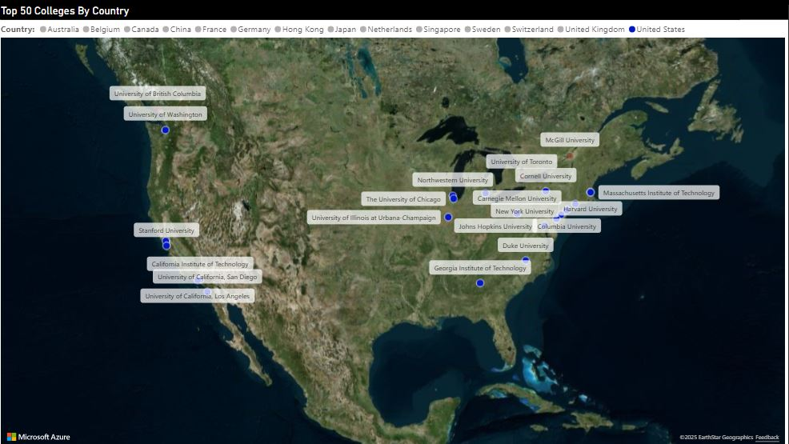
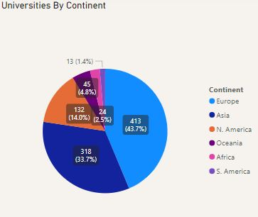
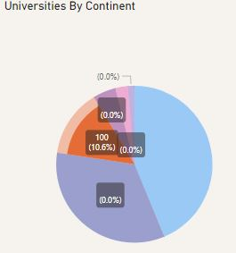
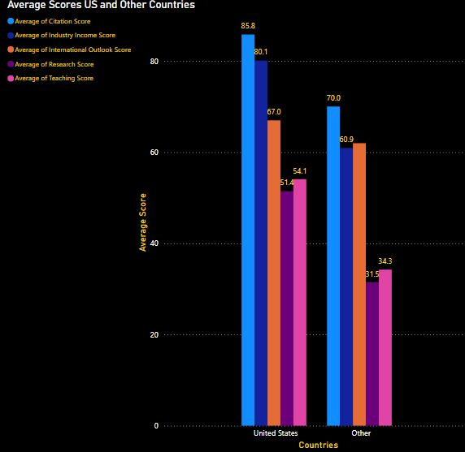
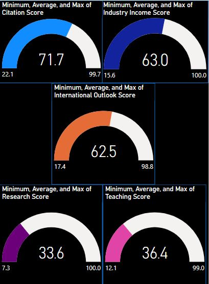
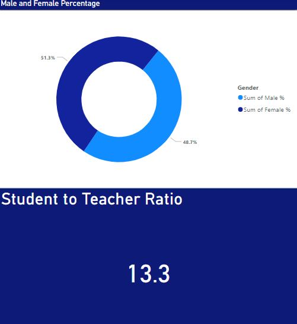
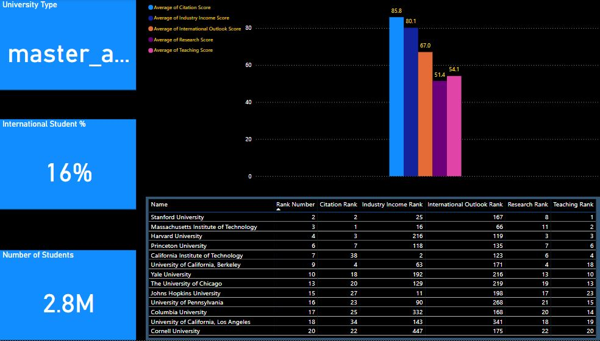
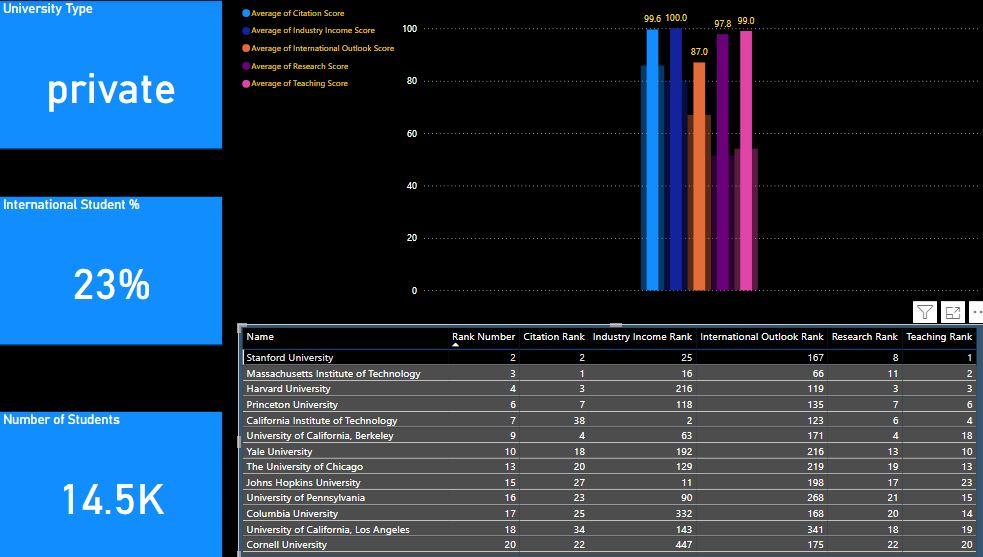

# :mortar_board: Times University Rankings 2024 Power BI Project

[Link to Power BI file for Download](https://github.com/Chazzledazzle13/TimesUniversityRankings/blob/main/Times-University-2024-Rankings-PowerBI.pbix)

[Link to Times University Rankings 2024](https://www.timeshighereducation.com/world-university-rankings/2024/world-ranking)

[Link to Kaggle Data Power BI Project Was Made From](https://www.kaggle.com/datasets/ddosad/timesworlduniversityrankings2024/code)

## Takeaways

1. For the top 50 colleges by overall rank, 22 are located within the United States. The top college according to the university rankings is Stanford University. California has the most of any states with 5 universities. Illinois has the 2nd most with 3 Universities. 

2. Out of the 945 universities included in the list, 132 are located in North America. Out of those 132, 100 are located in the United States (75.76%). In total, the United States accounts for 10.6% of all universities included on the list.

3. There are five different criteria to decide scoring:
   1. Citation
   2. Industry Income
   3. International Outlook
   4. Research
   5. Teaching
  
**For more information on the methodology, click the following link:** [Times University Rankings 2024 Methology](https://www.timeshighereducation.com/world-university-rankings/world-university-rankings-2024-methodology)

See below for how the United States compared to other countries: 

4. The United States also beats the average for all categories(100 being the best score, and 0 being the lowest):
   1. Citation
      US: 85.8  Average: 71.7
   2. Industry Income
      US: 80.1  Average: 63.0
   3. International Outlook
      US: 67.0  Average: 62.5
   4. Research
      US: 51.4  Average: 33.6
   5. Teaching
      US: 54.1  Average: 36.4
      

5. The average student to teacher ratio for top United States universities is 13.3, for all countries it is 18.5. Of the top universities males make up 48.7%, females 51.3% of top colleges compared to females 51.7% and males 48.3% for universities worldwide.

6. Out of the total 2.8 million students included within these top universities, international students make up roughly 16% or 448,000. Stanford University, who is the #1 ranked US university, has a 23% international student rate of their 14,500 students (or roughly 3,335).

